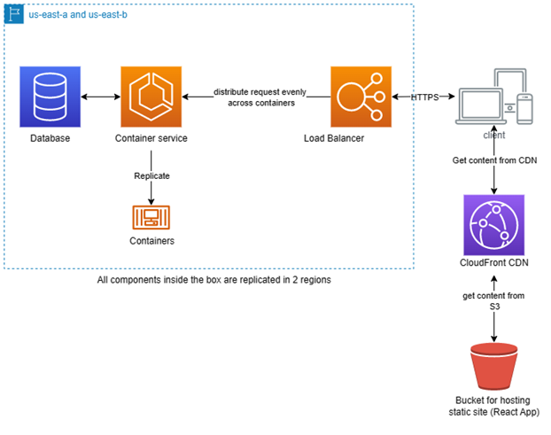

# CPSC-559-FINAL-PROJECT
This repository contains the code for the Final Project of the course CPSC 559 - Introduction to Distributed Systems. The design and the implementation of this system will be evolving as our knowledge expands on the topic of distributed systems.
## Team Information
---
### __Group 12__
- ### __Front End__
    To Be Determined
- ### __Back End__
    To Be Determined
### __Background__
Our team shares an interest in trivia games. Despite the abundance of trivia games in the market, we could not find a free game that features private lobbies. Therefore, we came up with the idea to build our own trivia game.
### __Motivation and objective__
We are looking to apply knowledge acquired during the lectures of CPSC 559 and through research on our own time about distributed systems. Our team is interested in different hobbies such as cars, animals, movies, music and we love playing video games. Therefore, we came to the conclusion that a fun way to learn about distributed systems is to channel our passions in creating a client-server based trivia game. This game would then be available as open source for all trivia lovers to be able to create private lobbies and play trivia with their friends.
### __Overview of the application__
Our application will be delivered as a web app. When users visit our website, they can either create a lobby or join an existing one. If creating, the user will be provided a code that others can use to join the same session. The owner of the lobby can start the game at any time, after which all players within the lobby will be able to play the game.
### __Architecture__
Ideally the system should be implemented in the Client-Server architecture. Once a game session is started, the server should send all clients within the same lobby a list of trivia questions retrieved from the database on the backend. Clients can then start answering questions and the server will accept the first correct answer it receives from any of the clients.
The following is the architecture diagram for our trivia application

### __Implementation__
There are a few aspects of distributed systems that our team will take into consideration when developing our system :

1. __Replication__:

    We intend to do replication on the database. The main idea is to host the database on AWS and spread it across multiple availability zones. We are also investigating replicating the server by Dockerizing and hosting it across multiple availability zones.

2. __Communication__:

    The client and server will communicate over HTTPS (TCP/IP), the model of communication is Transient Synchronous Communication

3. __Synchronization__: 

    When dealing with a multi threaded application, it is essential to avoid race conditions and deadlock situations. We intend to implement synchronization by coordinating all the threads and make sure the actions are performed in a specific order avoiding more than one thread to update a resource at any specific time

4. __Consistency__:  

    We intend to propagate all the changes to the database in a timely manner and make sure that all the nodes see the same data at any time. Any discrepancies to data is not allowed.

5. __Fault Tolerance__: 

    Since we have database replication, we intend to have a health check system to detect outages and a load balancer to route requests to healthy instances. The load balancer will distribute the requests between instances to ensure none are overloaded while others are idling. Furthermore, since we have replication, that means we have redundancies in place in cause of a server crash.
